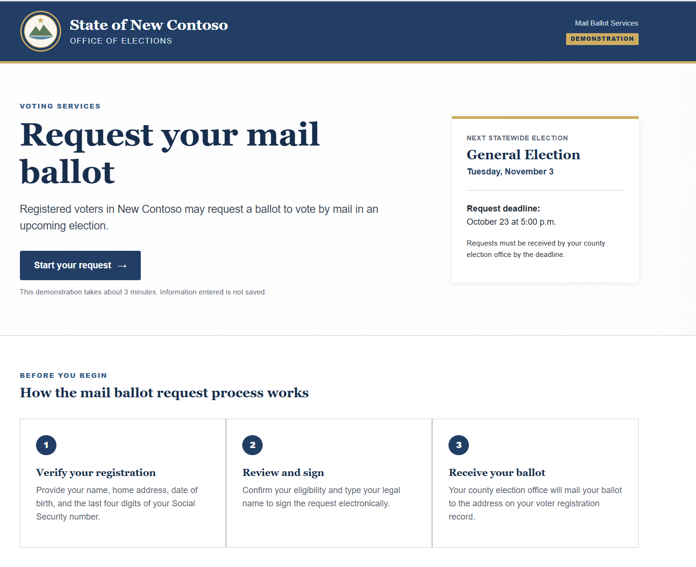
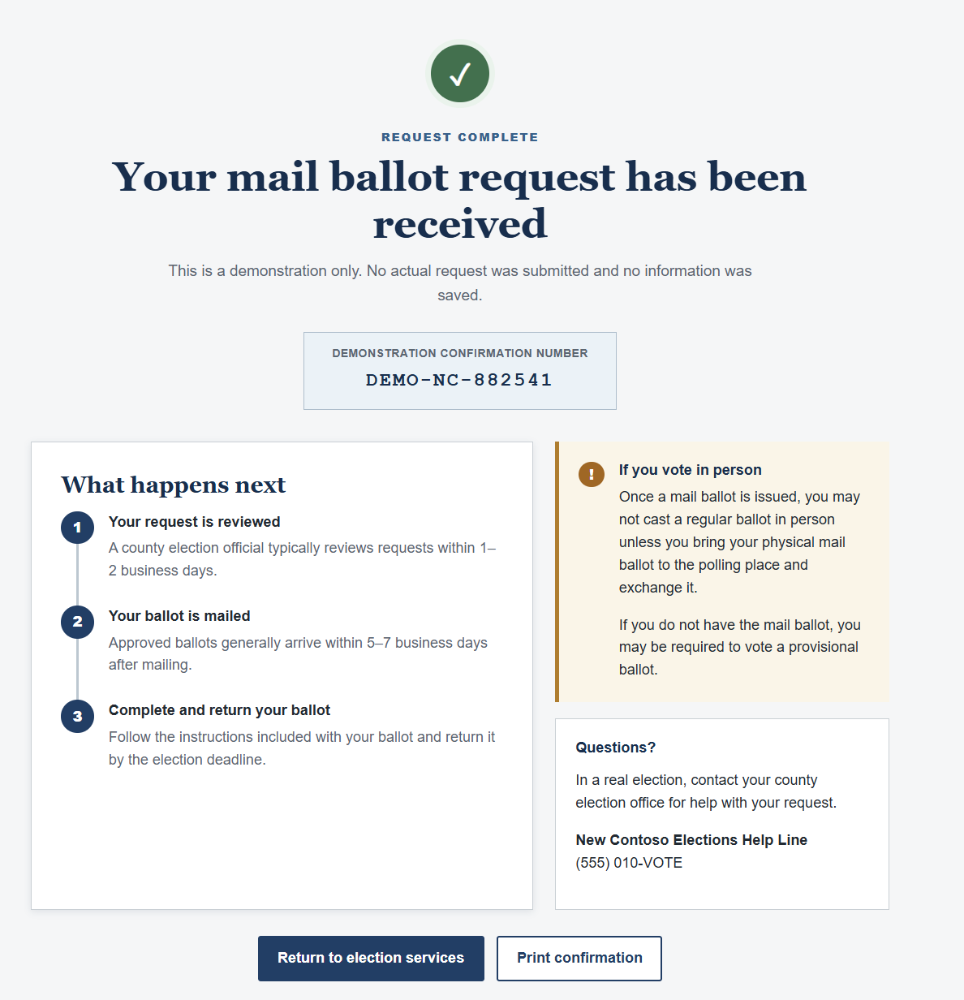
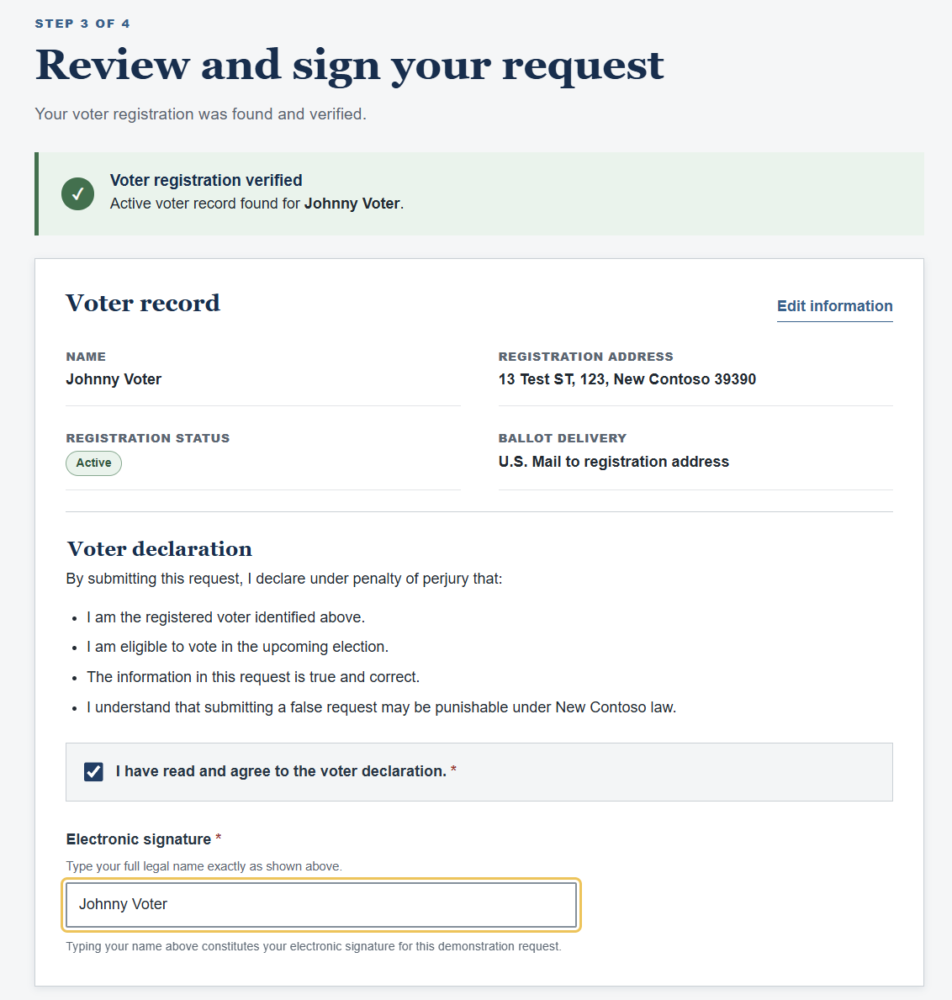

# Mail Ballot Request Agent

The **Mail Ballot Request Agent** is an assistant designed to help an eligible voter agentically complete their own mail-ballot request form on the New Contoso state election office's website.

⌚ Save time and have your agent request your ballot for you!

The experience works best with **Microsoft Copilot using Browser Control in Microsoft Edge**.

## What the agent does

The agent can:

- Open the mail-ballot request webpage
- Fill in form fields using information the user provides
- Submit the form automatically - it'll even enter your name as a signature!

## Quick Start

The experience works best with **Microsoft Copilot using Browser Control in Microsoft Edge**.

1. Open the agent file in this repository.
2. Start Copilot in Edge with Browser Control enabled.
3. Ask Copilot to help complete your mail-ballot request.
4. Sit back and enjoy some time saved.

## Screenshots

---

*Note: this a fictional agent for exercise purposes only*
